CHATFUTSAL

futsal with chat

풋살 소셜 모임을 이용중에 생각지 못한 상황때문에 <br>
경기를 주최하는 사용자와 소통하는 방법이  부족하다는 판단 하에 서비스를 만들어 보자는 생각으로 시작했습니다.

용병 모집자와 용병 참여자 간에 실시간으로 채팅이 가능한 앱 입니다.

0.1.0 version

용병모집 CRUD <br>
실시간 채팅 Firebase snapshot <br>
kakao Maps API 연동 위치 안내


### Firebase 데이터 설계
```
firestore/
├── users/
│   └── {userId}                    # 사용자 정보
├── chatRooms/
│   └── {roomId}                    # 채팅방 정보
│       └── messages/{messageId}    # 메시지 (서브컬렉션)
└── recruitPosts/
└── {postId}   
```

### 1. 회원가입 / 로그인

### 2. 실시간 채팅 

### 3. 읽음 처리

