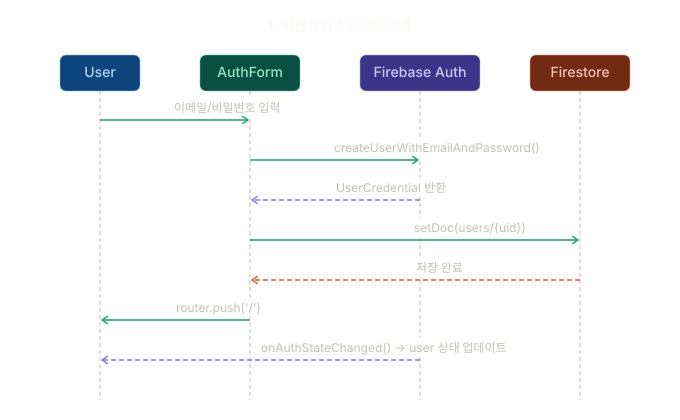
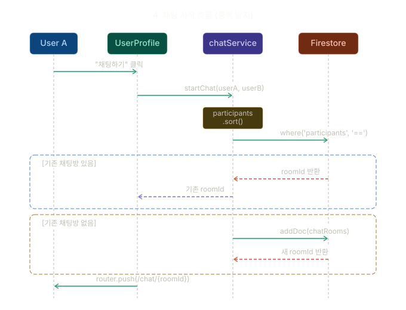
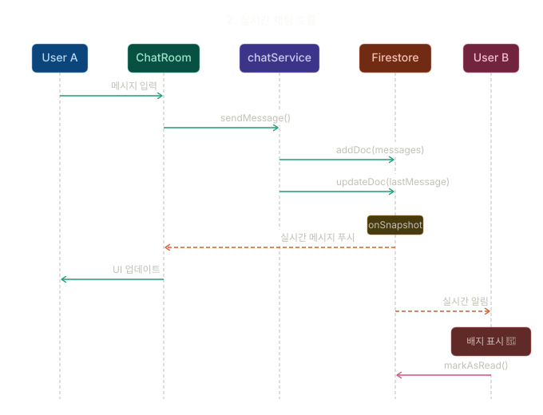
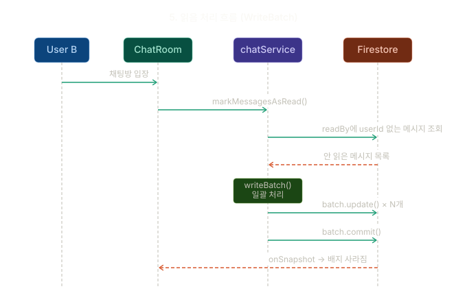

# ⚽ CHATFUTSAL

> **futsal with chat** — 풋살 용병 모집부터 참가 신청, 실시간 채팅까지 한 곳에서

용병을 구하는 경기 주최자와 참여하려는 사용자가 **바로 대화할 수 있는** 풋살 용병 매칭 서비스입니다.
기존 용병 모집 방식에서는 주최자와 소통할 창구가 부족하다는 문제에서 출발했습니다. 모집글, 참가 신청, 1:1 실시간 채팅을 하나의 흐름으로 연결했습니다.

**버전** `0.1.0`

<br>

## 주요 기능

### 🔐 인증
- 이메일/비밀번호 회원가입 · 로그인 (Firebase Authentication)
- **카카오 간편로그인**: 카카오 OAuth 인가 코드를 Next.js API Route에서 처리하고, Firebase Admin SDK로 Custom Token을 발급해 기존 유저 시스템과 통합

### 📋 용병 모집
- 모집글 **작성 · 조회 · 수정 · 삭제** (CRUD)
- 경기 날짜·시간, 장소, 실력 레벨(비기너 / 아마추어 / 세미프로 / 프로), 모집 인원 설정
- **카카오맵 장소 검색**: Places API로 구장을 검색해 좌표·주소를 저장하고, 상세 페이지 지도에 위치 표시
- **검색 · 필터**: 키워드(제목·내용·장소, 입력 디바운스 적용), 날짜, 지역, 레벨
- 작성자의 수동 마감 / 재오픈

### ⏱ 모집 자동 마감
- **정원 도달 시** 자동 마감: 수락 인원이 모집 인원에 도달하면 `closed` 처리
- **경기 시간 경과 시** 자동 마감: 목록·상세 조회 시 경기 시작 시각이 지난 글을 마감 처리
- 작성·수정 화면에서 과거 날짜 선택 방지

### 🙋 참가 신청 · 수락
- 신청 메시지와 함께 참가 신청, 대기 중 신청 취소
- 작성자는 신청 목록에서 **수락 / 거절** (거절된 사용자는 재신청 가능)
- 중복 신청 방지 (`applicantIds`)

### 💬 실시간 채팅
- Firestore `onSnapshot` 기반 1:1 실시간 채팅
- 모집글 또는 사용자 프로필에서 채팅 시작 (기존 채팅방이 있으면 재사용)
- 사용자 검색으로 새 대화 시작
- **읽음 처리** 및 채팅방별 안 읽은 메시지 수, 하단 탭 뱃지 표시
- 채팅방 나가기

### 🔔 알림
- 참가 신청 접수, 수락, 거절 시 실시간 알림
- 알림 목록 페이지에서 확인 후 관련 모집글로 이동

### 👤 마이페이지 · 프로필
- 내가 작성한 모집글, 내가 신청한 모집 목록
- 다른 사용자 프로필 조회 및 채팅 시작

<br>

## 기술 스택

| 구분 | 사용 기술 |
|------|-----------|
| Framework | Next.js 16 (App Router), React 19 |
| Language | TypeScript |
| Styling | Tailwind CSS 4, shadcn/ui (Radix UI), lucide-react |
| Backend (BaaS) | Firebase Authentication, Cloud Firestore |
| Server | Next.js API Route, Firebase Admin SDK |
| 외부 API | Kakao Login (OAuth), Kakao Maps JavaScript API / Places |

<br>

## 화면 구성

| 경로 | 설명 |
|------|------|
| `/` | 홈 |
| `/recruit` | 모집글 목록 (검색 · 필터) |
| `/recruit/[postId]` | 모집글 상세 · 지도 · 참가 신청 |
| `/recruit/[postId]/edit` | 모집글 수정 |
| `/create` | 모집글 작성 |
| `/chat` | 채팅방 목록 |
| `/chat/[roomId]` | 채팅방 |
| `/notifications` | 알림 목록 |
| `/mypage` | 마이페이지 |
| `/mypage/recruits` | 내가 작성한 모집글 |
| `/mypage/applications` | 내가 신청한 모집 |
| `/users/[userId]` | 사용자 프로필 |
| `/login`, `/signup` | 로그인 · 회원가입 |
| `/auth/kakao/callback` | 카카오 로그인 콜백 |

<br>

## 프로젝트 구조

```
src/
├── app/                  # 페이지 (App Router)
│   └── api/auth/kakao/   # 카카오 로그인 → Firebase Custom Token 발급
├── components/           # UI 컴포넌트 (RecruitCard, ChatRoom, KakaoMapSearch 등)
├── hooks/                # 실시간 구독 훅 (useRecruitPosts, useMessage, useNotifications 등)
├── lib/
│   ├── firebase/         # Firebase 클라이언트 초기화 · 에러 메시지 처리
│   ├── firebase-admin.ts # Firebase Admin SDK (서버 전용)
│   ├── services/         # Firestore 쓰기 로직 (recruit, application, chat, notification)
│   └── utils/            # 날짜 · 만료 판별 유틸
└── types/                # 공통 타입 정의
```

읽기는 **hooks**에서 `onSnapshot`으로 실시간 구독하고, 쓰기는 **services**에 모아 역할을 분리했습니다.

<br>

## Firestore 데이터 설계

```
firestore/
├── users/{userId}                     # 사용자 정보 (provider: email | kakao)
├── recruitPosts/{postId}              # 모집글 (status, needCount, acceptedCount, applicantIds, locationCoord)
├── applications/{applicationId}       # 참가 신청 (status: pending | accepted | rejected)
├── notifications/{notificationId}     # 알림 (recipientId, type, isRead, link)
└── chatRooms/{roomId}                 # 채팅방 (participants, lastMessage)
    └── messages/{messageId}           # 메시지 (readBy로 읽음 처리)
```

<br>

## 주요 흐름

### 1. 회원가입 / 로그인


### 2. 채팅 시작


### 3. 실시간 채팅


### 4. 읽음 처리


<br>

## 기능 명세서

- [참가 신청 · 수락 시스템](./docs/features/참가신청시스템.md)
- [모집 자동 마감](./docs/features/모집자동마감.md)
- [카카오 간편로그인](./docs/features/카카오간편로그인.md)

<br>

## 로컬 실행

```bash
git clone https://github.com/oldwater0224/chatfutsal.git
cd chatfutsal
npm install
npm run dev
```

프로젝트 루트에 `.env.local`을 만들고 아래 값을 채워야 합니다.

```env
# Firebase (Client)
NEXT_PUBLIC_FIREBASE_API_KEY=
NEXT_PUBLIC_FIREBASE_AUTH_DOMAIN=
NEXT_PUBLIC_FIREBASE_PROJECT_ID=
NEXT_PUBLIC_FIREBASE_STORAGE_BUCKET=
NEXT_PUBLIC_FIREBASE_MESSAGING_SENDER_ID=
NEXT_PUBLIC_FIREBASE_APP_ID=

# Firebase Admin (Server, 카카오 로그인 Custom Token 발급용)
FIREBASE_ADMIN_PROJECT_ID=
FIREBASE_ADMIN_CLIENT_EMAIL=
FIREBASE_ADMIN_PRIVATE_KEY=

# Kakao
NEXT_PUBLIC_KAKAO_MAP_JS_KEY=
NEXT_PUBLIC_KAKAO_REST_API_KEY=
NEXT_PUBLIC_KAKAO_REDIRECT_URI=
KAKAO_CLIENT_SECRET=
```

> 카카오맵과 카카오 로그인을 사용하려면 Kakao Developers에 사이트 도메인(`http://localhost:3000` 등)과 Redirect URI를 등록해야 합니다.
